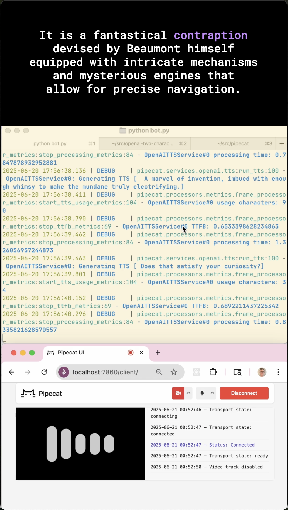

# Two AI voices demo — Pipecat frame processors



[Video demo](https://www.youtube.com/watch?v=6Jjbm0cMbeM)

This demo shows how to use prompting, steerable TTS models, and Pipecat frame processors to create a story-telling experience with two AI voices.

The idea is to prompt the LLM to use a tag to identify separate voices, then use Pipecat frame processors to separate the LLM output into two streams, each with its own TTS model.

Here's the format we're prompting for:

```
AA
Rosamund work up early because it was Saturday. She thought to herself

BB
I hope that the friendly owl comes back to visit today.
```

Here's our Pipecat pipeline. The custom frame processors are:
  - CharacterTagger
  - CharacterGate
  - CharacterRetagger
  - TTSSegmentSequencer

```
pipeline = Pipeline(
    [
        transport.input(),
        stt,
        context_aggregator.user(),
        llm,
        CharacterTagger(),
        ParallelPipeline(
            [CharacterGate("AA"), tts_narrator, CharacterRetagger("AA")],
            [CharacterGate("BB"), tts_character, CharacterRetagger("BB")],
        ),
        TTSSegmentSequencer(),
        transport.output(),
        context_aggregator.assistant(),
    ]
)
```

The two slightly tricky things here are:

1. We're splitting each LLM inference response into several segments, and sending those segments through parallel processing pipelines. The TTS generations are asynchronous and could complete in any order. We need to make sure each segment is sent down the pipeline in the correct order. We also don't want to introduce any extra buffering or delay! There are several ways to design this. Here, we buffer all the segments in the CharacterTagger processor. Whenever possible, we stream token-by-token as usual, but if a previous segment hasn't finished generating, we buffer. Because TTS runs faster than real-time, this introduces almost no additional playout delay.

2. We can't just strip the tags from the LLM output. This is a multi-turn conversation, and all output becomes context for future turns. If we strip the tags, we'll slowly "teach" the LLM not to use tags at all. So we re-insert the tags after the TTS generation. We are altering the LLM output, because we're being a little bit lazy and leaving the responses split into separate segments. The context aggregator stores each voice segment as a separate "assistant" message in the context history. We could fix this, but GPT-4o handles it fine. Other LLMs/APIs wouldn't like this.

## Run the code yourself

